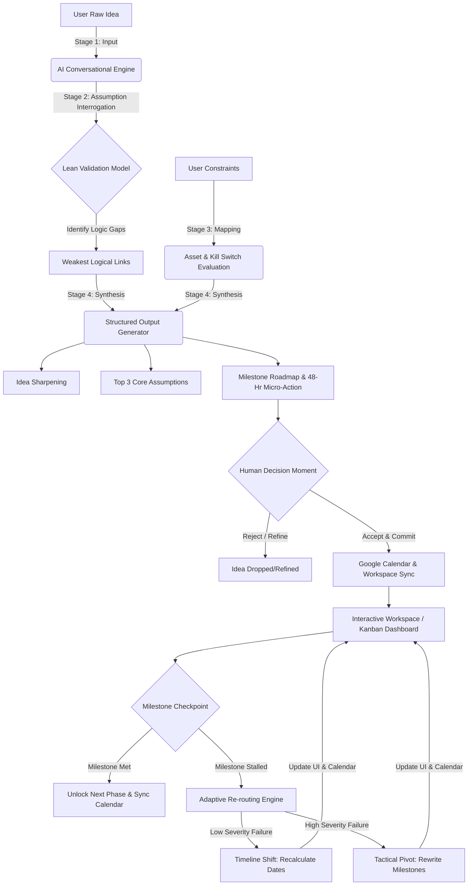
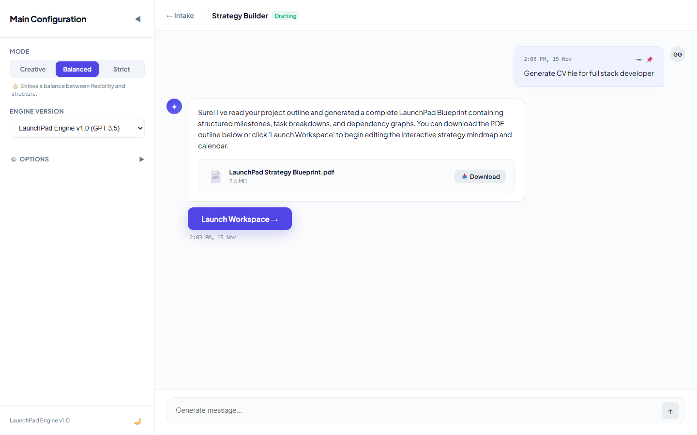
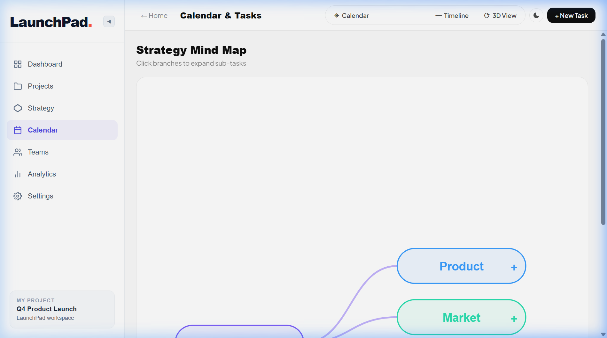
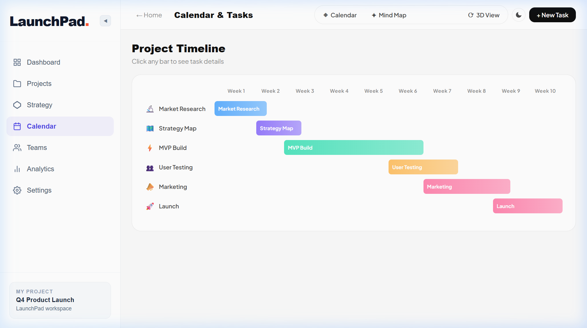
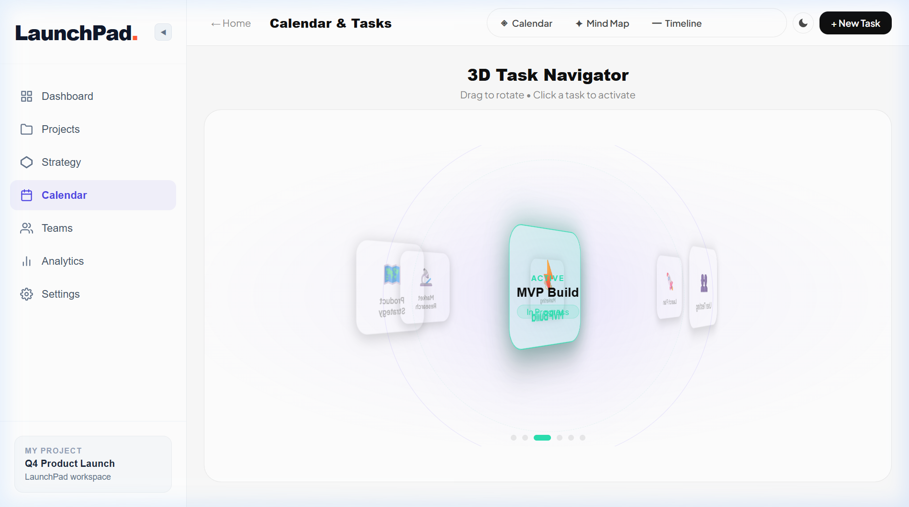

# LaunchPad 🚀

[](https://launchpad-l61r.onrender.com/)
[](https://youtu.be/kEIWSLoMAPI)

**LaunchPad** is an interactive, web-based decision-support platform designed to help creators, students, and early professionals clear cognitive overload, stress-test business or project hypotheses, and systematically execute tasks through a dynamic feedback loop.


---

## 🌟 The Problem
Often, innovators and creators suffer from cognitive overload when ideating. They struggle to validate their business hypotheses, determine their target audience, and outline the critical assumptions that could make or break their project. Without a structured way to test these assumptions objectively, many projects stall or fail prematurely due to unvalidated constraints or over-reliance on false confidence.

## 💡 The Solution
LaunchPad acts as a thinking mirror and structured synthesizer. It guides users through an intuitive, minimal interface to systematically dismantle their idea into testable parts. It helps users:
1. **Interrogate Assumptions:** Breaks down raw, unstructured ideas into core components like target customer, value proposition, willingness to pay, and delivery method.
2. **Map Constraints:** Evaluates user assets, available hours per week, budget limits, technical skill levels, and "The Kill Switch" (self-identified fatal flaws).
3. **Generate Actionable Roadmaps:** Creates a calendar-bound execution plan (30/60/90-Day Milestones) heavily focused on disproving the riskiest assumptions early on.
4. **Pivot or Persevere:** Offers a dynamic, adaptive re-routing engine that recalibrates timelines or suggests tactical pivots if a milestone stalls, ensuring the user maintains momentum.

## 🎯 Target Audience
- **Creators & Builders:** Anyone looking to systematically launch a new project, application, or product.
- **Students & Researchers:** Undergraduates mapping out complex research or structured validation for academic projects.
- **Early Professionals & Founders:** Entrepreneurs needing a lean, unbiased system to test their assumptions rigorously before risking large amounts of capital or time.

---

## 🗺️ Process & Information Flow (How the App Works)

Here is a visual flowchart showcasing how LaunchPad captures user inputs, interrogates assumptions against business models, evaluates constraints, outputs actionable plans, and dynamically reroutes timelines or strategies when milestones are stalled:



---

## 🏗️ Stage-by-Stage App Walkthrough

### 💬 Stage 1 & 2: Idea Intake & Assumption Interrogation
The journey starts with a clean, distraction-free conversational chat interface. The AI guide prompts you to explain your idea. Once submitted, LaunchPad's LLM prompt chain immediately stress-tests your idea, isolating logical gaps (e.g. customer segmentation, willingness to pay) and prompting you to clarify them.


### 🛠️ Stage 3: Builder Page (Constraint Mapping)
In the builder page, users specify industry-related parameters, identify target customers, and map out concrete constraints:
* **Available Hours / Week**
* **Technical Skill Level**
* **Available Budget**
* **The "Kill Switch"** (your self-identified fatal flaw)



### 📊 Stage 4: Workspace Dashboard
Once validated, a structured project summary is generated. The interactive Workspace page provides a dashboard displaying:
* **Idea Sharpening:** A concise, validated overview of your product/service.
* **Top 3 Core Assumptions:** The fundamental conditions that must be true for your project to survive.
* **The 48-Hour Micro-Action:** One simple, actionable task to break initial builder inertia.
* **The Uncomfortable Risk:** A brutal, objective assessment of what could go wrong.


### 📅 Stage 5: Gated Calendar & Multi-Layout Workspace
After accepting and committing to the roadmap, the application redirects you to a multi-layout dashboard with 4 core tabs:
1. **Calendar View:** A standard calendar grid displaying milestone dates and proactive check-in events.
2. **Mind Map View:** An interactive graph database showing ideas connected to assumptions, constraints, and risks.
3. **Timeline View:** A clean Gantt chart visualizing Milestones 1, 2, and 3.
4. **3D View:** A futuristic Three.js carousel visualizing milestones and task nodes in 3D space.

*Note: In compliance with the Gated Dashboard logic, downstream milestones remain greyed out (`disabled=True`) until the user validates previous milestones.*

#### Calendar Grid View


#### Mind Map View


#### Gantt Timeline View


#### Three.js 3D Node View


---

## ⚙️ Core Engine & Automation Integrations (The AI Part)

- **AI Orchestration & Sequential Routing:** LaunchPad leverages chain-of-thought Natural Language Processing (NLP) and decision-support framework chains to process logic gaps progressively. Instead of one massive prompt, the system chains Stage 1 inputs into Stage 2 questions, and passes those answers into Stage 4 synthesis.
- **Google Calendar Sync Loop:** Once committed, LaunchPad triggers a synchronization loop that connects via OAuth (or webhooks like Make/Zapier) to generate a dedicated calendar named `"LaunchPad: [Project Name]"`. It places milestone due dates relative to `DateTime.now()` and maps out proactive check-in events as ambient notification reminders.
- **Adaptive Re-Routing Engine (Failure Logic):** If a user hits an impasse and reports failure on a milestone, LaunchPad does not stall. The AI evaluates the feedback and assigns a severity category:
  - *Low Severity (Friction):* Triggers a **Timeline Shift** (recalculates dates and pushes downstream calendar events forward).
  - *High Severity (Structural Roadblock):* Triggers a **Tactical Pivot** (repositions the business model by dynamically rewriting milestones while keeping timeline boundaries intact).

---

## 🛠️ Tools Used & Technical Stack

LaunchPad is designed with a lightweight, responsive stack optimized for high-performance interactive states:

- **Frontend Core:** **React (v19)** powered by **Vite** for rapid bundling and hot module replacement (HMR).
- **Routing:** **React Router (v7)** handles clean routing between `/`, `/intake`, `/builder`, `/workspace`, and `/calendar`.
- **Iconography:** **Lucide React** for modern, crisp UI indicators.
- **3D Rendering:** **Three.js** provides the interactive 3D node carousel visualization.
- **Styling:** Custom vanilla CSS (`index.css` & `App.css`) for high-performance glassmorphism, responsive grid layouts, and custom dark mode themes.

## 🚀 Getting Started

Follow these steps to run LaunchPad locally:

1. **Clone the repository:**
   ```bash
   git clone https://github.com/yourusername/launchpad-web.git
   cd launchpad-web
   ```

2. **Install Dependencies:**
   Make sure you have Node.js installed, then execute:
   ```bash
   npm install
   ```

3. **Configure Environment Variables:**
   Create a `.env` file in the root directory based on `.env.example` to provide your required API keys (e.g., Google OAuth client credentials and backend endpoints).

4. **Run the Development Server:**
   ```bash
   npm run dev
   ```

5. **Access the App:** 
   Open your browser and navigate to `http://localhost:5173`.

---

*LaunchPad was built to act as a rigorous thinking mirror—challenging assumptions while keeping human intuition firmly at the center of the innovation process.*
