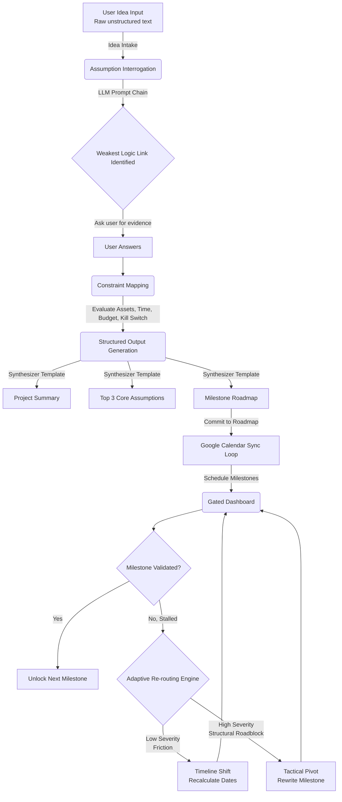

# LaunchPad 🚀

[](https://launchpad-l61r.onrender.com/)
[](https://youtu.be/kEIWSLoMAPI)

**LaunchPad** is an interactive, web-based decision-support platform designed to help creators, students, and early professionals clear cognitive overload, stress-test business or project hypotheses, and systematically execute tasks through a dynamic feedback loop.


## 🔄 How LaunchPad Processes Information (Flowchart)



## 🌟 The Problem
Often, innovators and creators suffer from cognitive overload when ideating. They struggle to validate their business hypotheses, determine their target audience, and outline the critical assumptions that could make or break their project. Without a structured way to test these assumptions objectively, many projects stall or fail prematurely due to unvalidated constraints or over-reliance on false confidence.

## 💡 The Solution
LaunchPad acts as a thinking mirror and structured synthesizer. It guides users through an intuitive, minimal interface to systematically dismantle their idea into testable parts. It helps users:
1. **Interrogate Assumptions:** Breaks down raw, unstructured ideas into core components like target customer, value proposition, willingness to pay, and delivery method.
2. **Map Constraints:** Evaluates user assets, available hours per week, budget limits, technical skill levels, and "The Kill Switch" (self-identified fatal flaws).
3. **Generate Actionable Roadmaps:** Creates a calendar-bound execution plan (30/60/90-Day Milestones) heavily focused on disproving the riskiest assumptions early on.
4. **Pivot or Persevere:** Offers a dynamic, adaptive re-routing engine that recalibrates timelines or suggests tactical pivots if a milestone stalls, ensuring the user maintains momentum.

## 🎯 Target Audience
- **Creators & Builders:** Anyone looking to systematically launch a new project, application, or product.
- **Students & Researchers:** Undergraduates mapping out complex research or structured validation for academic projects.
- **Early Professionals & Founders:** Entrepreneurs needing a lean, unbiased system to test their assumptions rigorously before risking large amounts of capital or time.

## 🏗️ Architecture & How It Works

LaunchPad uses a sequential processing engine to guide the user through five functional stages:

1. **Stage 1: Idea Intake** 
   - A minimalist conversational interface captures the raw, unstructured project idea string ("Tell me what you're trying to build or do").
2. **Stage 2: Assumption Interrogation**
   - An LLM prompt chain acts as an interrogator, parsing the raw text against standard business validation models (Lean Startup frameworks). It isolates the weakest logical link and prompts the user for evidence.
3. **Stage 3: Constraint Mapping**
   - The platform dynamically assesses real-world human constraints based on user inputs, balancing the ambition of the project with actual available resources.
4. **Stage 4: Structured Output Generation**
   - The AI passes the accumulated context into a synthesizer template, outputting a concise project summary, the **Top 3 Core Assumptions**, and a **Milestone Roadmap** (including a 48-Hour Micro-Action and an Uncomfortable Risk assessment).
5. **Stage 5: Human Decision Moment (Responsible AI Layer)**
   - The platform explicitly refuses to make the final "Pivot or Kill" decision. It presents the synthesized logic and places the ultimate choice back into the hands of the user, acting as a guardrail against false confidence.


## ⚙️ Core Engine & Automation Integrations (The AI Part)

- **AI Orchestration & Sequential Routing:** LaunchPad leverages chain-of-thought Natural Language Processing (NLP) and decision-support framework chains to process logic gaps progressively. Instead of one massive prompt, the system chains Stage 1 inputs into Stage 2 questions, and passes those answers into Stage 4 synthesis.
- **Google Calendar Sync Loop:** Once a user commits to a roadmap, LaunchPad handles Google Calendar OAuth insertion. It translates phased roadmap days into calendar block boundaries relative to real-time (e.g., locking a 5-day duration for Milestone 1) and automatically schedules subtle ambient check-in reminders.
- **Gated Dashboard & Milestone Logic:** The application serves as an interactive kanban board controlling state. Future milestones remain disabled and greyed-out until the prerequisite actions are actively validated.
- **Adaptive Re-Routing Engine (Failure Logic):** If a user hits an impasse, the app calculates a severity score based on feedback. 
  - *Low Severity (Friction):* Triggers a Timeline Shift (recalculates dates and pushes downstream calendar events forward).
  - *High Severity (Structural Roadblock):* Triggers a Tactical Pivot (keeps original timelines but dynamically rewrites the nature of the milestone to suggest lower-cost alternative paths).


## 🛠️ Tools Used & Technical Stack

To keep implementation fast, responsive, and robust, LaunchPad is built with the following technologies:

- **Frontend & Dashboard:** **React** + **Vite** for a lightning-fast, state-driven UI experience. React Router handles seamless navigation between Intake, Workspace, Builder, and Calendar views.
- **Styling:** Vanilla CSS combined with **Lucide React** for minimal, clean iconography and modern design aesthetics.
- **AI Orchestration Backend:** Designed around visual LLM orchestration concepts (such as LangChain/LangGraph) to easily chain and manage conversation state without bloated logic.
- **Calendar Automation:** Google Calendar API logic streamlined for dynamic event creation, translating roadmap objects directly into scheduled JSON payloads.

## 🚀 Getting Started

Follow these steps to run LaunchPad locally on your machine:

1. **Clone the repository:**
   ```bash
   git clone https://github.com/yourusername/launchpad-web.git
   cd launchpad-web
   ```

2. **Install Dependencies:**
   Ensure you have Node.js installed, then run:
   ```bash
   npm install
   ```

3. **Configure Environment Variables:**
   Rename `.env.example` to `.env` and provide your respective API keys (e.g., for AI Orchestration and Google Calendar).

4. **Run the Development Server:**
   ```bash
   npm run dev
   ```

5. **Access the App:** 
   Open your web browser and navigate to `http://localhost:5173`.

---

*LaunchPad was built to act as a rigorous thinking mirror—challenging assumptions while keeping human intuition firmly at the center of the innovation process.*
